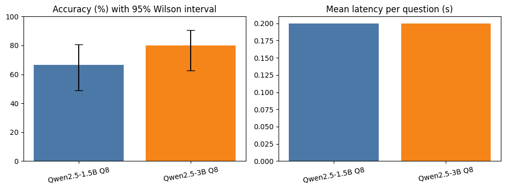

# Local LLM Evaluation: Qwen2.5 (GGUF) on Indonesian Tasks

[](https://colab.research.google.com/github/arielshakaramiro/local-llm-eval/blob/main/notebooks/local_llm_eval.ipynb)
[](https://github.com/arielshakaramiro/local-llm-eval/actions/workflows/tests.yml)


> **TODO before publishing:** run the notebook, run `python scripts/update_readme.py`, then write the parts marked TODO below (the finding and the takeaways). Delete this note.

A small, reproducible evaluation of open-weight models self-hosted with `llama-cpp-python` (no external API). Experiments were run on a Google Colab GPU runtime. It answers two practical questions:

1. **How much does model size matter?** Qwen2.5-1.5B vs 3B (both Q8 GGUF) on 30 Indonesian-language questions, with accuracy, latency and throughput measured under the same conditions.
2. **Can a small model produce reliable structured output?** OCR text from technical drawings and BOMs is converted to JSON, comparing prompt-only decoding against **schema-constrained decoding**.

## At a glance



**Finding:** TODO one or two sentences with numbers: accuracy of each model with its interval, the latency cost, and what schema-constrained decoding changed.

## Highlights

- **Statistics suited to small samples.** 95% Wilson intervals for accuracy and an exact McNemar test for the paired model comparison, so differences are not over-claimed.
- **Grading that does not punish correct answers.** Regex groups (`must` / `forbid`) accept correct answers written as sentences, unlike exact matching.
- **Self-validating dataset.** Every question ships an example right and wrong answer, checked automatically in the test suite.
- **Structured output evaluated, not eyeballed.** Valid-JSON rate, strict schema conformance, and field-level accuracy over labelled samples.
- **Tested code with CI.** Core logic lives in `src/llm_eval.py`; the pytest suite runs on every push without downloading any model.
- **Environment recorded with the results.** GPU, library version and whether GPU offload is actually active are saved to `results/environment.json`, so timings are tied to the hardware they came from.

## Project structure

```
local-llm-eval/
├── notebooks/local_llm_eval.ipynb   # runs both experiments, writes results/
├── src/llm_eval.py                  # loading, chat, grading, statistics, extraction
├── data/
│   ├── questions_id.json            # 30 questions: 10 easy / 10 medium / 10 hard
│   └── ocr_samples.json             # 8 hand-labelled OCR samples (4 clean, 4 anomalous)
├── scripts/update_readme.py         # fills the result tables below from results/
├── tests/                           # pytest suite (no model needed)
├── .github/workflows/tests.yml      # CI
├── results/                         # CSV, Markdown tables, figure and environment of the last run
└── requirements.txt
```

## Method

**Models.** `Qwen2.5-1.5B-Instruct` and `Qwen2.5-3B-Instruct`, 8-bit GGUF, loaded once each with a 4096-token context. Greedy decoding (`temperature=0`), the model's own chat template, and one warm-up call before timing.

**Benchmark.** Arithmetic and facts (easy), short explanations graded by keyword groups (medium), and multi-step reasoning (hard). Questions are in Indonesian on purpose. The metrics are accuracy with a 95% Wilson interval, mean latency, tokens per second, and the number of truncated answers.

**Structured extraction.** Each OCR sample must yield `components` (part number, description, material, quantity, supplier, dimensions) plus an `anomalies` list. Two modes run on the same samples:

| Mode | How JSON is obtained |
|---|---|
| `prompt_only` | The prompt describes the JSON shape; output is parsed afterwards |
| `schema_constrained` | Same prompt plus a JSON Schema via `response_format`, restricting which tokens can be generated |

Scored per sample: valid JSON, strict schema conformance (for example, `quantity` must be an integer), correct part number, correct quantity, and correct anomaly flag (non-empty `anomalies` only if the record has a real problem). Unparseable output scores as wrong on every metric.

## Results

The tables below are generated by `scripts/update_readme.py` from the files in `results/`.

### Benchmark (30 questions)

<!-- BENCHMARK_SUMMARY:START -->
_Generated after a run._
<!-- BENCHMARK_SUMMARY:END -->

### Accuracy by difficulty (%)

<!-- BENCHMARK_BY_LEVEL:START -->
_Generated after a run._
<!-- BENCHMARK_BY_LEVEL:END -->

### Structured extraction (8 samples, rates in %)

<!-- EXTRACTION_SUMMARY:START -->
_Generated after a run._
<!-- EXTRACTION_SUMMARY:END -->

### Environment

<!-- ENVIRONMENT:START -->
_Generated after a run._
<!-- ENVIRONMENT:END -->

### Key takeaways

TODO: 2–4 sentences. Cover accuracy versus size (do the intervals overlap?), the latency cost, the effect of schema-constrained decoding on validity and on accuracy, and where the models fail.

## Limitations

- 30 questions and 8 extraction samples are small; the confidence intervals show how wide the uncertainty is.
- Regex grading approximates correctness and can miss valid phrasings.
- One greedy run per model; timings depend on hardware.
- Only Q8 quantization and a single model family were tested, and Indonesian is the only benchmark language.
- Extraction labels are hand-written and anomalies are planted, not drawn from production data.

## Reproduce

**Colab (recommended).** Click the badge above, select a GPU runtime, and run all cells. The notebook clones the repository if needed and builds `llama-cpp-python` with CUDA (5–10 minutes). A plain `pip install` yields a CPU-only build even on a GPU runtime, so the install cell handles this explicitly and the environment cell warns if GPU offload is not active.

**Your own machine.**

```bash
git clone https://github.com/arielshakaramiro/local-llm-eval.git
cd local-llm-eval
pip install -r requirements.txt
jupyter notebook notebooks/local_llm_eval.ipynb
```

For an NVIDIA GPU, install with `CMAKE_ARGS="-DGGML_CUDA=on" pip install --no-cache-dir -r requirements.txt`. On Apple Silicon, use `CMAKE_ARGS="-DGGML_METAL=on" pip install --no-cache-dir -r requirements.txt`. Layer offload is then enabled automatically.

**After a run**, refresh the tables in this README:

```bash
python scripts/update_readme.py
```

**Tests** (no model download required):

```bash
pip install pytest
pytest -q
```

## Models and licenses

Model weights are not included in this repository; they are downloaded from Hugging Face at run time. Each model has its own license. Check the model card before any commercial use, since the 1.5B and 3B models may be under different terms.

## Acknowledgements

The first exercises in this project came from the LLM course by Ruby Thalib (Session 1: Introduction to LLM). The evaluation design, datasets and code in this repository extend those exercises.

## License

MIT, see [LICENSE](LICENSE).
